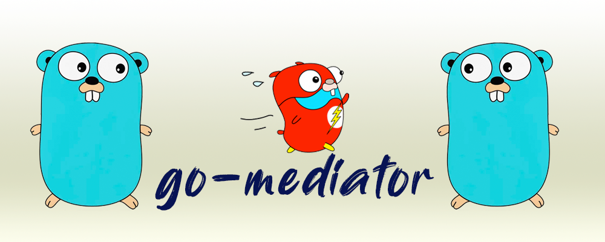

<div align="center" style="margin-bottom:20px">
  
  <div align="center">
    <a href="https://github.com/deltics/go-mediator/actions/workflows/qa.yml"></a>
    <a href="https://goreportcard.com/report/github.com/deltics/go-mediator" ></a>
    <a>= 1.18" src="https://img.shields.io/badge/go%20version-%3E=1.18-61CFDD.svg?style=flat-square"/></a>
    <a href="https://github.com/deltics/go-mediator/blob/master/LICENCE"></a>
    <a href="https://coveralls.io/github/deltics/go-mediator?branch=master"></a>
    <a href="https://pkg.go.dev/github.com/deltics/go-mediator"></a>
  </div>
</div>

<br/>

# go-mediator

A light-weight implementation of the [Mediator Pattern](https://en.wikipedia.org/wiki/Mediator_pattern) for `goLang`, inspired by [jbogard's MediatR framework for .net](https://github.com/jbogard/MediatR) but with far more limited ambition (_for now at least_).

<br/>

## Mediator Pattern
[The Mediator](https://en.wikipedia.org/wiki/Mediator_pattern) is a simple [pattern](https://en.wikipedia.org/wiki/Software_design_pattern) that uses a 3rd-party (the mediator) to facilitate communication between two other parties without them requiring knowledge of each other.

It is a powerful pattern for achieving loosely-coupled code.

There are many ways to implement a mediator, from simple `func` pointers to sophisticated and complex messaging systems.

`go-mediator` sits firmly at the *simple* end of that spectrum and intends staying there!

<br/>

## What go-mediator Is NOT
- `go-mediator` is not a message queue
- `go-mediator` is not asynchronous
- `go-mediator` is not complicated!

<br/>

# Concepts
`go-mediator` maintains a registry of handlers for specific request types.

Requests are submitted to the `mediator` which consults the registry to locate the handler for that request type which is then passed the request.  The results from the handler are then passed back to the original caller.

`go-mediator` maintains *separate* handler registries for `Command` handlers and `Query` handlers.

`go-mediator` makes distinction between `Command` handlers and `Query` handlers:

- A `Command` handler returns _only_ an `error`
- A `Query` handler returns *a value* **and** an `error`

```go
// These types are not used in go-mediator, but illustrate
// the difference between 'Command' and 'Query'
func Command(context.Context, Request) error
func Query(context.Context, Request) (Result, error)
```

Treating them differently allows code that uses `go-mediator` to benefit from type inference to simplify calls made to `Commands` in a way that isn't (currently?) possible with a `Query`.

Handlers may (*optionally*) implement validation of requests as a separate concern from the handler execution.

<br/>

# Getting Started

## 1. Define a Request Type
Your handlers receive only two values: a context and a request, so everything that your handler needs to satisfy a request must be contained in one or other of those.

The request type is also the public, unique indentity of a handler.  A caller does not know which handler will satisfy a request, only that there can be only one handler for each type of request.  

This means that if you have different handlers that accept the same types of values, then you will need separate and distinct request types for each one, e.g.

```go
    type FooRequest struct {
        Foo string
    }

    type BarRequest struct {
        Bar string
    }
```

An exception to the "*one handler per request type*" rule is that you *can* have separate `Command` and `Query` handlers employing the same `request` type.

**NOTE: A future update is being considered to also allow Request types to be shared by Query Handlers having different *result* types.** 

<br/>

## 2. Implement a Handler Interface
Handlers are generic interfaces with a single `Execute` method accepting a `context` and a `request`.

Both `Command` and `Query` handlers accept a `TRequest` type parameter that identifies the type of the request value that is handled.  A `Query` handler interface additionally requires a *`TResult`* type parameter, to identify the type of the return value (in addition to any `error`):

```golang
    // The CommandHandler interface...
    type CommandHandler[TRequest any] interface {
        Execute(context.Context, TRequest) error
    }

    // and the QueryHandler interface...
    type QueryHandler[TRequest any, TResult any] interface {
        Execute(context.Context, TRequest) (TResult, error)
    }
```

A command handler implementation would be similar to this example:

```golang
    // FooHandler is a CommandHandler (returns `error`)
    type FooHandler struct {}

    func (*FooHandler) Execute(ctx context.Context, req FooRequest) error {
        // Do some foo'ing
        return nil
    }
```

**NOTE: Since handlers are interface implementations, the underlying struct may be used to hold services employed by the handler. This may be useful in test code for substituting fake or mock services.  See more on testing further below...**

<br/>

## 3. Register the Handler
Handlers are registered by passing the handler implementation to the appropriate `mediator` registration function.

The registration functions are generic functions with the same `TRequest` type (and `TResult` type for `Query` handlers) as the corresponding handler.  The `go` type system then ensures that the handler supplied is valid for the type(s) specified:

```golang
    RegisterCommandHandler[FooRequest](&FooHandler{})

    RegisterQueryHandler[BarRequest, string](&BarQueryHandler{})
```

<br/>

## 4. Implement RequestValidator (*optional*)
In addition to the `Execute()` method of the `Command` or `Query` handler interface, handlers may *optionally* implement the `RequestValidator` interface:

```golang
    type RequestValidator[TRequest any] interface {
	    Validate(context.Context, TRequest) error
    }
```

**If** implemented by a handler, this will be called by `mediator` *before* the `Execute()` method.  If the `Validate()` method returns an error then the `Execute` method will not be called; the validation error is returned to the caller as an `ErrBadRequest`.

For handlers with non-trivial request validation needs, this enables validation concerns to be isolated from the handler behaviour which can then get straight down to the business of satisfying the request.

It also ensures that request validatation failures are returned to callers as an `ErrBadRequest` error, enabling them to differentiate between these errors and more general failures in the handler.  This can be useful when making `mediator` calls from http endpoints, for example.

### Returning Errors from Execute() vs Validate()
An `Execute()` method can of course (and should) be explicit in returning a `mediator.ErrBadRequest{}` error when appropriate, regardless of whether a separate request validator is provided.

A `RequestValidator` implementation on the other hand can return any `error` from `Validate()` and `mediator` will **ensure** this is wrapped in a `ErrBadRequest` on your behalf.  The error won't be wrapped if it is already an `ErrBadRequest`.

<br/>

## 5. Send Requests to Handlers Via Mediator
To call a `Command` or `Query`, construct a request of the required type and pass it to `mediator` using either the `Command()` or `Query()` function, as appropriate:

```golang
    err := mediator.Command(ctx, &FooRequest{ Foo: "do something for me" })

    err := mediator.Query[FooRequest, string](ctx, &FooRequest{ Foo: "get me something nice" })
```

Notice that for `Command` requests the request type does not need to be specified - `go` is able to infer the type from the request parameter itself.

This is not (currently?) possible for `Query` requests (I believe because the result type is not represented in the parameters).  Hence for `Query` requests both the request and result type parameters must be identified.

<br/>

# Alternative Result Handling
_**!! Here Be Dragons !!**_

Results other than errors may be returned by a `Command` handler by using a by reference result type (e.g. pointer to struct).

The handler may then manipulate the members of the request, usually limited to ones provided explicitly for the purpose of "returning" a value (or values).

This avoids using a `Query` and the more cumbersome need to specify request and result types everywhere, but comes at the expense of the familiar `result, error` pattern:

```golang
    result, err := mediator.Query[FooRequest, string](FooRequest{})
    if err != nil {
        log.Error(err)
        return err
    }
```

Might become something similar to:

```golang
    request := &FooRequest{}
    err := mediator.Query[*FooRequest, string](request)
    if err != nil {
        log.Error(err)
        return err
    }
    result := request.Result
```

A bigger issue is that careful attention must be paid to such handlers receiving their requests *by reference*.  If passed *by value*, any updates to the request members will be applied to a *copy* of the request, **not** the one held by the original caller.

But your tests will pick up such blunders, right?

It is also not always immediately clear that this is the intended use of such requests, so consider carefully whether the syntactic streamlining is worth these trade-offs.

And of course, whenever passing by reference, you need to keep a watchful eye on potential concurrency issues.

This is not to either recommend (or condemn) such an approach, merely to highlight that it is possible.

(_In practice I use this technique **very** occasionally myself, for communicating "side-effects", rather than returning actual "results"_)

<br/>

# Testing With Mediator

The loose-coupling that can be achieved with a mediator has obvious utility when it comes to testing code.

Most obviously it enables code under test to make requests that are picked up by *test* handlers, rather than *production* handlers, without the code under test having to do anything to achieve this or even being aware that it is happening!

There are some other benefits of the particular implementation of `go-mediator`, as well as a couple of gotchas to watch out for...

<br/>

## Handler Dependency Injection
A handler implemented as a `struct` may hold references to services *required by* the handler implementation, injected at the time that the handler is initialised (usually at the time of registration).

For example a handler might employ a repository interface:

```golang
    type FooHandler struct {
        Repository   FooRepository
    }
```

Since handlers registered as part of the initialisation of your application or service (e.g. in `main.go`) will not have been registered when your tests run, this provides an opportunity to '*inject*' *alternative* services.

That is, you might still be exercising the *production* handler, but injecting *test dependencies* for it to use.

For example, subsituting an in-memory repository to remove dependency on a physical database when running tests.

<br/>

## Fake/Mock Handlers
As well as providing for the injection of test dependencies into *production* handlers, the decoupling of handlers and requestors also means that tests can subtitute entirely different handlers.

For example, if your application or service produces kafka events, `Commands` that produce an event may be subtituted with a "spy" that enables a test to verify that the correct event was produced to the correct topic, and without even needing kafka to be available to run the test.

<br/>

## De-and Re-Registering Handlers
It is good practice for tests to be self-contained and independent.

This means that when code under test makes `mediator` requests, an appropriate handler *must* be registered by that test *and **removed*** when done, so that other tests can register their own handlers for the same request type, if necessary.

Fortunately the handler registration functions return a registration reference for just this purpose, providing a single method: `Remove()` which will, well, remove the registration for the handler that was just registered.

So a typical test would start something like this:

```golang
func TestSomethingThatMakesMediatorRequests(t *testing.T) {
    // ARRANGE
    reg := RegisterCommandHandler[*FooRequest](&FakeFooHandler{})
    defer reg.Remove()

    // ACT
    ... test some code that Perform()s a `FooRequest`

    // ASSERT
    ...
}
```
